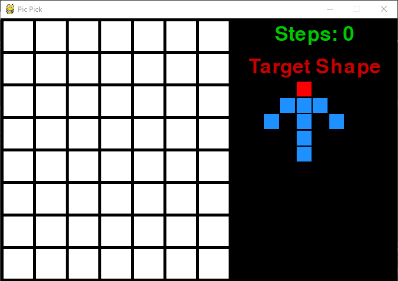

# Pic Pick Game
## The game idea is inspired by a game in the Chinese Variety Show called 'Detective School (名侦探学院)'.

## About This Game
* Target shape is shown on the right of the screen
* Target shape is hidden under the white grid, and may be in different orientations
* Click on the cells to reveal what is underneath 
* GOAL is to find the HEAD of the shape in as fewer steps as possible

## Game Mechanics and Tips
* Gray means you missed, and the target could be elsewhere
* Blue means you have clicked on the target BODY, but not the Head
* Red means you have Successfully found the target HEAD
* Try to deduce the correct position of the HEAD from the shape of the target and revealed cells

## Game Screenshots
Start of the game:  
   
Game screen:  
   
Win by find the RED HEAD:  
   
Example of a complete shape:  

## HARD MODE
* Three different shapes
* GOAL is to find all 3 HEADs
* Added new feature: player can press and hold R to reveal the answer  
Game screen:  
   
Reveal the answer:  

## Future version may PvP mode
